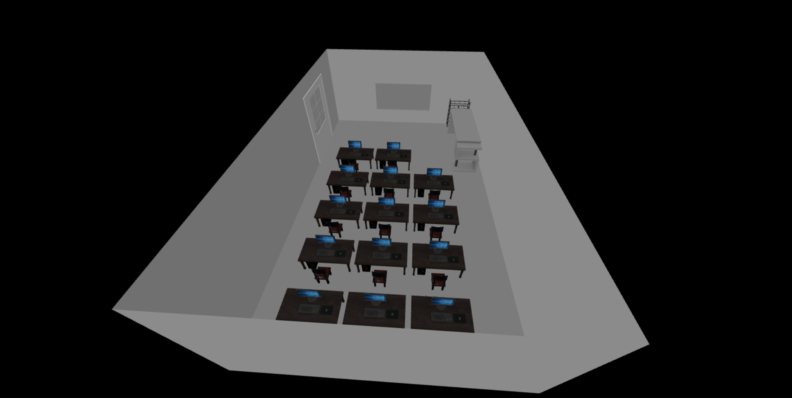

# 3D Lab Room

The **3D Lab Room** is an interactive 3D space built using **Three.js** and **Vite**.

## Technologies Used

<div align="center">
  
  
  
</div>
<!-- 
- **Three.js**: A powerful JavaScript library for 3D graphics.
- **Vite**: A modern build tool that provides fast development and optimized production builds.
- **JavaScript**: The main programming language for building the project. -->

## Installation

#### Clone the Repository

```bash
git clone https://github.com/jobairalsarkar1/3d_lab_room.git
cd 3d_lab_room

git checkout -b <your branch name>
npm install
```

#### Run

```
npx vite
```
